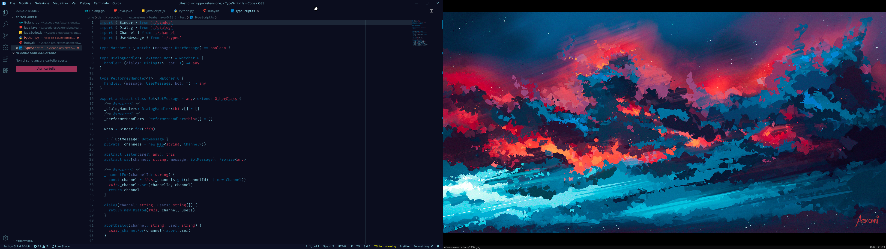
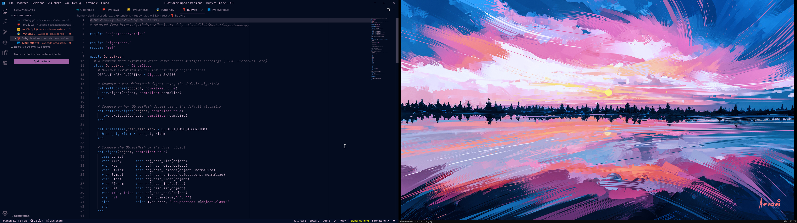
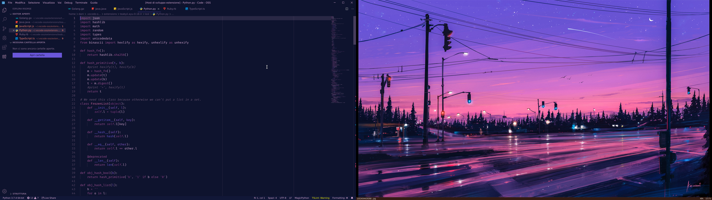

# Wal Theme

This extensions for Visual Studio Code adds a new **real time** theme that is dynamically generated from the color palette provided by [pywal](https://github.com/dylanaraps/pywal).

## Features

- Real time updates of the color scheme
- Two variants available: borderless and bordered
- Works out of the box: no setup needed, just run pywal as you normally would

## Requirements

In order to use this extension pywal is needed, it should be run before updating the theme provided by this extension.

## Extension Settings

This extension contributes the following setting:

* `walTheme.autoUpdate`: enable/disable the auto update of the theme provided by this extension

## Release Notes

The release notes can be find in the [changelog](https://github.com/dlasagno/vscode-wal-theme/blob/master/CHANGELOG.md)

---

## Credits

This extension is inspired by [Ayu](https://github.com/ayu-theme/vscode-ayu) and [vscode-wal](https://github.com/bluedrack/vscode-wal).
